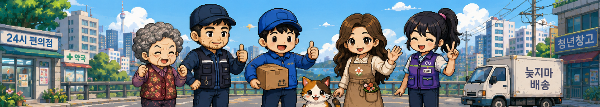
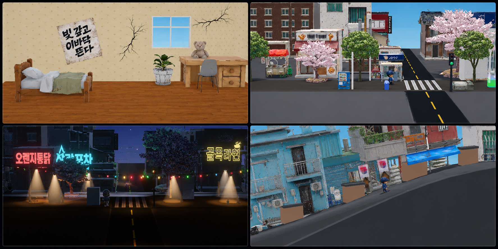
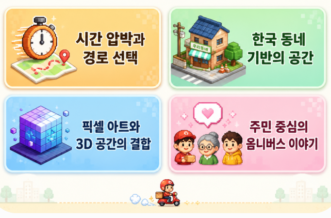
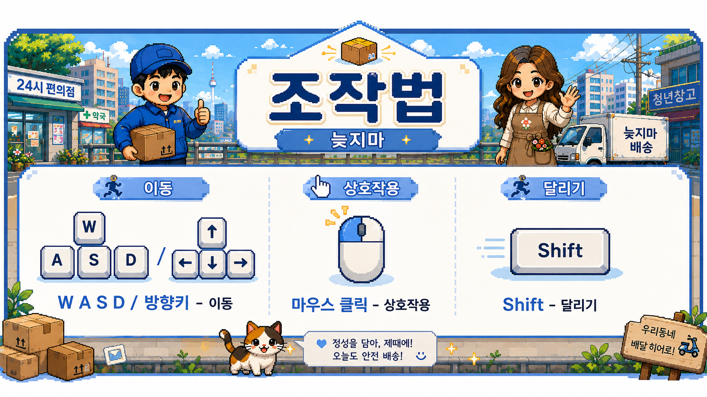

<p align="center">
  
</p>

<h1 align="center">늦지마</h1>

<p align="center">
  <b>시간에 쫓기며 동네 곳곳의 택배를 배달하는 지각 압박 배송 생존 게임</b>
</p>

<p align="center">
  
  
</p>

<p align="center">
  <a href="https://namkuri.github.io/Don-t-late/">
    
  </a>
</p>

## 📦 게임 소개

**늦지마**는 제한 시간 안에 배송지를 확인하고, 택배를 챙겨 동네 곳곳에 배달하는 캐주얼 배송 게임입니다.

플레이어는 좁은 골목과 언덕길, 아파트와 상가를 오가며 배송을 수행합니다. 무작정 달리는 것만으로는 부족합니다. 남은 시간, 이동 경로, 들고 있는 택배와 주민들의 요청을 함께 판단해야 합니다.

> 빨리 가야 한다. 하지만 아무 상자나 집으면 안 된다.

## 🎮 핵심 플레이

> 📦 **송장을 확인하고, 최적의 동선을 찾아 시간 안에 배송하세요!**

| 단계 | 플레이 |
|:---:|---|
| 🔍 | **송장과 배송지 확인** 후 올바른 택배를 선택합니다. |
| 🚚 | **제한 시간 안에** 목적지까지 빠르게 이동합니다. |
| 🗺️ | 배송 순서와 이동 경로를 판단해 **최적의 동선**을 만듭니다. |
| ⚡ | 스태미나와 남은 시간을 관리하며 **골목의 장애물**을 돌파합니다. |
| 💬 | 동네 주민들과 상호작용하며 **각자의 이야기**를 발견합니다. |
| 💰 | 배송 보상을 모아 **빚을 갚고**, 다음 배달을 준비합니다. |

<p align="center">
  <b>🔍 확인 → 📦 픽업 → 🏃 이동 → 🏠 배송 → 💰 정산</b>
</p>

<p align="center">
  <sub>빠르기만 해서는 부족합니다. 정확하게, 안전하게, 그리고 늦지 않게!</sub>
</p>

<p align="center">
  
</p>

## 🏘️ 주요 지역

| 지역 | 특징 |
| --- | --- |
| 아파트 | 복도, 엘리베이터, 반복되는 동과 호수 |
| 빌라촌 | 좁은 골목과 헷갈리는 주소 |
| 먹자골목 | 간판과 행인이 많은 번화가 |
| 언덕주택가 | 긴 오르막과 복잡한 배송 동선 |

## 👥 등장인물

동네에는 플레이어의 배송을 도와주거나, 잔소리하거나, 새로운 정보를 알려주는 주민들이 등장합니다.

- 베테랑 기사와 배송 동료
- 꽃집 주인과 편의점 직원
- 동네 사정을 훤히 아는 주민들
- 까칠하지만 정 많은 할머니
- 배송길을 따라다니는 삼색 고양이

각 NPC는 독립적인 대사와 관계도를 가지며, 플레이 과정에서 동네의 분위기와 이야기를 채웁니다.

## ✨ 게임 특징

<p align="center">
  
</p>

## 🕹️ 조작법

<p align="center">
  
</p>

## 🌐 WebGL 플레이

브라우저에서 별도 설치 없이 플레이할 수 있습니다.

**플레이:** [https://namkuri.github.io/Don-t-late/](https://namkuri.github.io/Don-t-late/)

<p align="center">
  <sub>Chrome 또는 Edge 최신 버전, 데스크톱 환경을 권장합니다.</sub>
</p>

## 🛠️ 개발 환경

- Unity
- C#
- TextMesh Pro
- Git / GitHub
- WebGL Build
- Blender 및 이미지 생성 도구를 활용한 아트 파이프라인

## 📁 프로젝트 구조

```text
Assets/
├─ Art/
│  ├─ Characters/
│  ├─ Environment/
│  ├─ Props/
│  └─ UI/
├─ Scenes/
├─ Scripts/
│  ├─ Core/
│  ├─ Player/
│  ├─ Delivery/
│  ├─ NPC/
│  └─ UI/
└─ Resources/
```

## 🚧 개발 상태

현재 개발 중인 프로젝트입니다.

- [x] 기본 이동 및 상호작용
- [x] 배송 정보 UI
- [x] 주요 NPC 및 캐릭터 아트
- [x] 기본 지역 구성
- [ ] 배송 루프 밸런싱
- [ ] 지역별 이벤트 확장
- [ ] 사운드 및 연출 보강
- [ ] WebGL 최적화
- [ ] 데모 빌드 공개

## 📸 스크린샷

플레이 화면과 배송 UI 스크린샷을 준비하고 있습니다.

<!-- 이미지 추가 후 주석을 해제하세요.


-->

## 🤝 기여

버그 제보와 개선 의견은 GitHub Issues를 통해 남겨주세요.

프로젝트 구조나 에셋 규칙을 변경하는 PR은 먼저 Issue에서 방향을 공유해 주세요.

## 📜 라이선스

코드와 게임 에셋의 라이선스는 서로 다를 수 있습니다. 외부 에셋과 폰트는 각 원저작자의 라이선스를 따릅니다.
