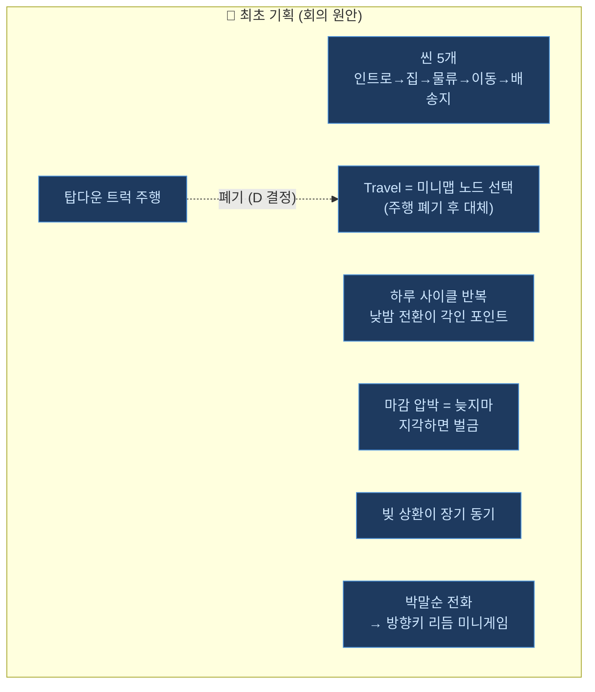
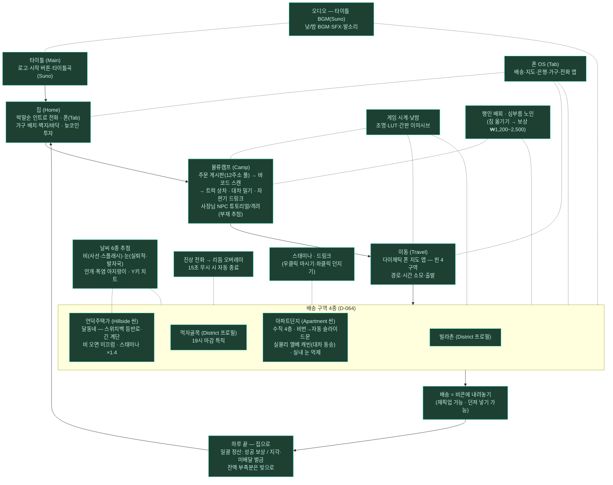

# 늦지마 — 게임 루프 지도 (LOOP.md)

> 작성 2026-07-25 (관제). 근거: [orders/system.md](../planning/orders/system.md) S-001~S-052 ·
> [decisions.md](../planning/decisions.md) D-064~068 · 아키텍처 v5.
> **색 범례** — 🔵 최초 기획(원안 개념) · 🟢 현재 구현 완료(실측 검증) · 🟡 확장 후보(설계·발주 여지) · 🔴 부족/미완(막힌 곳).

## 현재 하루 사이클 (구현 실체)

## 확장 후보 🟡 vs 부족한 곳 🔴

```mermaid
flowchart TD
    classDef done fill:#1e4032,stroke:#35e0c8,color:#c8f5ec
    classDef expand fill:#4a3a12,stroke:#e0b435,color:#f5e6b8
    classDef gap fill:#4a1e1e,stroke:#e05545,color:#f5c8c0

    LOOP["현재 하루 사이클<br/>(위 차트)"]:::done

    %% ── 확장 후보 (설계 여지 — 루프를 두껍게) ──
    E1["날씨 연동 오디오<br/>앰비언스·BGM 변주 (AU-018 발주됨)"]:::expand
    E2["액션 SFX 확충<br/>박스HP·굴림·점프·착지·눈발소리 (AU-018)"]:::expand
    E3["계단 스태미나 추가 가중<br/>지름길 vs 우회 선택 압박 강화"]:::expand
    E4["심부름 변주<br/>시간제한·무거운 짐·연쇄 심부름"]:::expand
    E5["BuildingSlot 태그(modern/moon)<br/>아트 카탈로그 자동 장착"]:::expand
    E6["구역별 조명 아이덴티티<br/>저지대 가로등 vs 달동네 백열등"]:::expand
    E7["진상 미니게임 변주<br/>난이도·패턴 추가 (현재 1종)"]:::expand
    E8["주간 목표·빚 이자<br/>장기 압박 곡선"]:::expand
    E9["행인 밀도·군중 연출<br/>먹자골목 야간 활기"]:::expand

    LOOP --- E1 & E2 & E3 & E4 & E5
    LOOP --- E6 & E7 & E8 & E9

    %% ── 부족한 곳 (미완·블로커) ──
    G1["엔딩/클리어 조건 부재<br/>빚 0원 도달 시 아무 일도 없음"]:::gap
    G2["아트 실물 대기<br/>캐릭터 정면 +Z·가구 5종·폰 UI 6종<br/>구름 3종·지도 일러 (민지 레인)"]:::gap
    G3["애니메이션 3종 대기<br/>idle·짐들고 걷기·기상 (남규 Mixamo)"]:::gap
    G4["P4 잔여 매니저<br/>Juice·PlayerEffects 일부 · ArtAuditReport"]:::gap
    G5["제출 전 최종 배포 1회<br/>D-072 묶음 체제 — 미배포 누적분(S-087~) 요청 시 일괄"]:::gap
    G6["치트 릴리스 가드 완료<br/>Y키 날씨·테스트 버튼 — 릴리스 빌드 제외 확인"]:::done
    G7["밸런스 미튜닝<br/>보상·벌금·시계 속도·스태미나 수치"]:::gap
    G8["지도 앱 조작감 폴리싱<br/>(남규님 지적 — 백로그)"]:::gap
    G9["앰비언스 반복감<br/>30s+ ×3종 재생성 대기 (AU-012→정수)"]:::gap

    LOOP --- G1 & G2 & G3 & G4 & G5
    LOOP --- G6 & G7 & G8 & G9
```

## 읽는 법 (요약)

| 색 | 의미 | 대표 |
|---|---|---|
| 🔵 원안 | 회의 최초 기획 개념 — 골격은 전부 살아 있고, 탑다운 주행만 폐기→폰 지도로 대체 | 5씬 사이클·마감 압박·빚·박말순 |
| 🟢 구현 | 실측 검증까지 끝난 현재 실체 — 하루 사이클은 **완주 가능** | 4구역·정산·날씨·NPC·폰 OS |
| 🟡 확장 | 루프를 두껍게 만들 후보 — 대부분 발주서 한 장 크기 | 날씨 오디오·심부름 변주·슬롯 아트 |
| 🔴 부족 | 심사 전 반드시 메워야 하는 구멍 | **엔딩 조건(발주 0)**·아트/애니 대기·밸런스 미튜닝 |

**관제 소견 (2026-07-29 감사 v2 반영)**: 루프 골격(🟢)은 원안(🔵)을 초과 달성했다.
구 🔴이던 WebGL 재배포는 D-072 묶음 체제로, 치트는 릴리스 가드로 해소 — 남은 진짜 🔴는
"**엔딩/클리어 조건**(빚 0원 도달 시 무반응 — 기획 결정 대기) + 아트 스왑 대기 + 밸런스"다.
마감(2026-08-10)까지 우선순위는 🔴 → 🟡(날씨 오디오·구역 조명 아이덴티티) 순.
